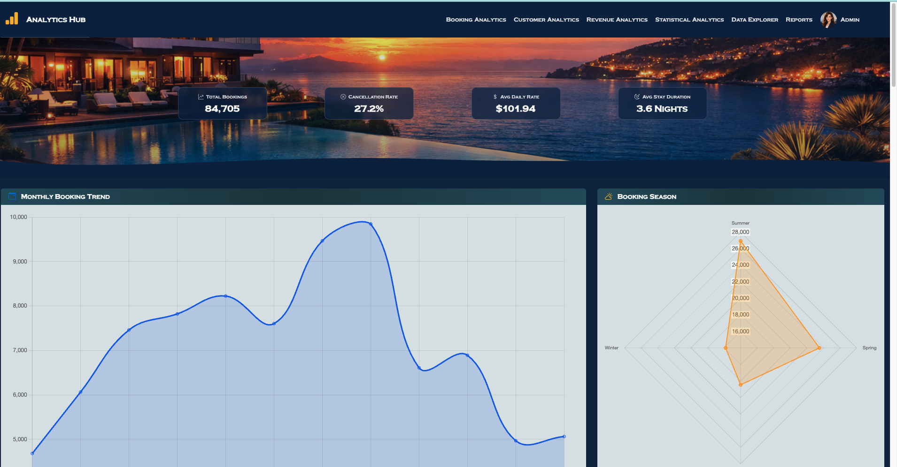
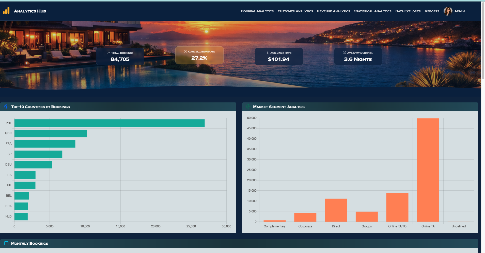
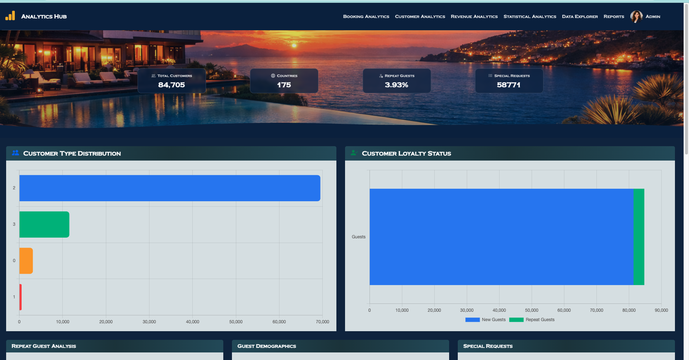
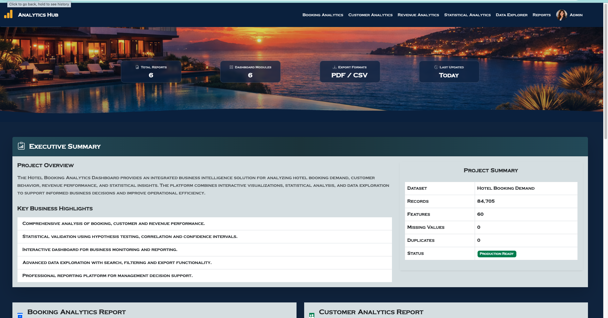
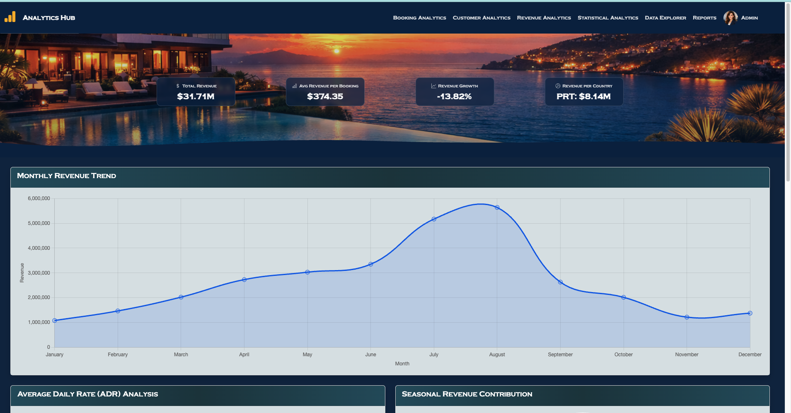
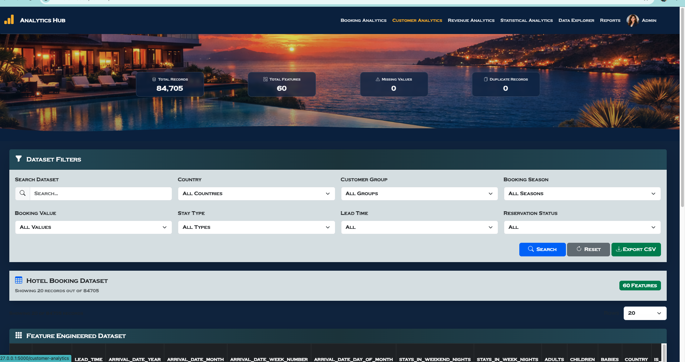
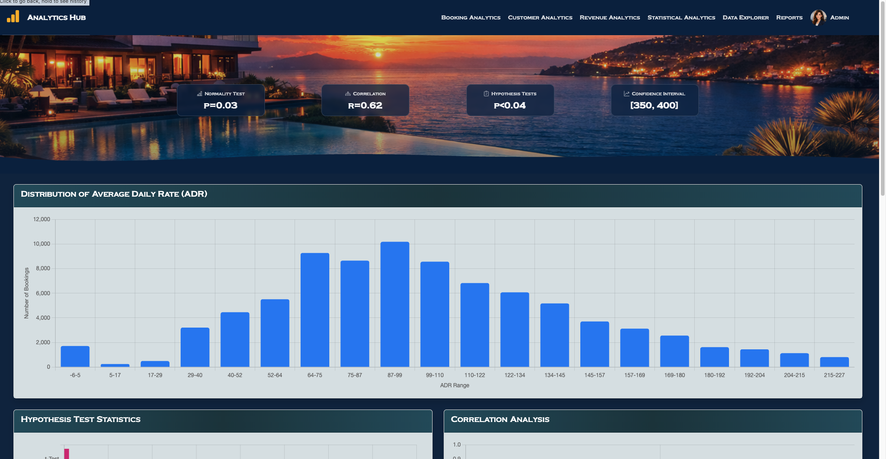

# Hotel Booking Analytics Dashboard


## Project Overview


The Hotel Booking Analytics Dashboard is a Business Intelligence and Statistical Analytics web application developed using Flask, Python, Pandas, Bootstrap, Chart.js, and Jupyter Notebook.


The project analyzes the Hotel Booking Demand dataset and transforms raw booking records into meaningful business insights through statistical preprocessing, exploratory data analysis (EDA), interactive dashboards, and downloadable PDF reports.


---


## Project Screenshot
















---


## Features


### Dashboard Modules


- Dashboard Overview
- Booking Analytics
- Customer Analytics
- Revenue Analytics
- Statistical Analysis
- Reports Center


---


### Statistical Analysis


The project includes


- Missing Value Analysis
- Invalid Value Detection
- Duplicate Removal
- Outlier Detection (IQR & Z-Score)
- Feature Encoding
- Feature Scaling
- Log Transformation
- Box-Cox Transformation
- Correlation Analysis
- Hypothesis Testing
- Statistical Summary Reports


---


### Reports


Professional PDF reports can be downloaded directly from the dashboard.


Available reports include


- Booking Analytics Report
- Customer Analytics Report
- Revenue Analytics Report
- Statistical Summary Report


---


## Technologies Used


### Backend


- Python
- Flask


### Data Analysis


- Pandas
- NumPy
- SciPy
- Scikit-learn


### Visualization


- Matplotlib
- Seaborn
- Chart.js


### Frontend


- HTML5
- CSS3
- Bootstrap 5
- JavaScript


### PDF Reports


- ReportLab


---


# Project Structure


```text
HOTEL_ANALYTICS_FINAL
│
├── app.py
├── reports.py
├── data.py
│
├── dataset
│   ├── hotel_bookings.csv
│   ├── hotel_bookings_cleaned.csv
│   ├── hotel_bookings_feature_engineered.csv
│   ├── eda_summary_report.pdf
│   └── statistical_summary_report.pdf
│
├── notebook
│   └── Jupyter Notebook Files
│
├── screenshots
│   └── dashboard.png
│
├── static
│   ├── css
│   ├── images
│   └── js
│
├── templates
│   ├── base.html
│   ├── index.html
│   ├── booking_analytics.html
│   ├── customer_analytics.html
│   ├── revenue_analytics.html
│   ├── statistical_analysis.html
│   ├── reports.html
│   └── data_explorer.html
│
└── README.md
```


---


## Dataset


Dataset Name


Hotel Booking Demand Dataset


Domain


Hospitality and Tourism


Records


119,390 Hotel Booking Records


Features


32 Original Features


---


## Installation


Clone the repository


```bash
git clone https://github.com/yourusername/Hotel_Analytics_Final.git
```


Move into the project


```bash
cd Hotel_Analytics_Final
```


Create virtual environment


### macOS


```bash
python3 -m venv venv
```


Activate


```bash
source venv/bin/activate
```


Install required packages


```bash
pip install -r requirements.txt
```


---


## Running the Application


Start Flask


```bash
python3 app.py
```


Open your browser


```
http://127.0.0.1:5000
```


---


## Dashboard Pages


- Home Dashboard
- Booking Analytics
- Customer Analytics
- Revenue Analytics
- Statistical Analysis
- Reports


---


## Reports Available


| Report | Format |
|----------|--------|
| Booking Analytics Report | PDF |
| Customer Analytics Report | PDF |
| Revenue Analytics Report | PDF |
| Statistical Summary Report | PDF |


---


## Statistical Techniques Implemented


- Missing Value Analysis
- Duplicate Detection
- Outlier Detection
- IQR Method
- Z-Score Method
- Label Encoding
- One-Hot Encoding
- Standardization
- Normalization
- Log Transformation
- Box-Cox Transformation
- Pearson Correlation
- Spearman Correlation
- Independent t-Test
- One-Way ANOVA
- Chi-Square Test
- Mann–Whitney U Test
- Kruskal–Wallis Test


