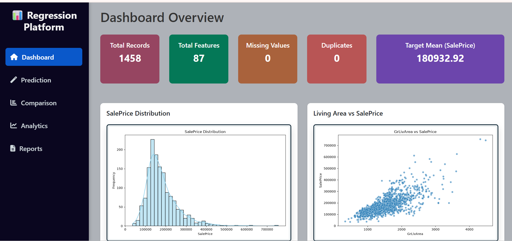
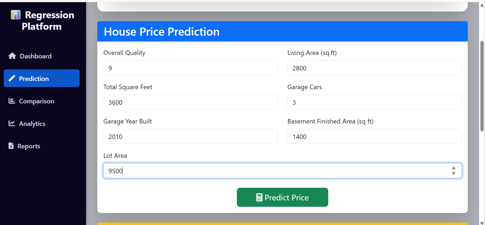
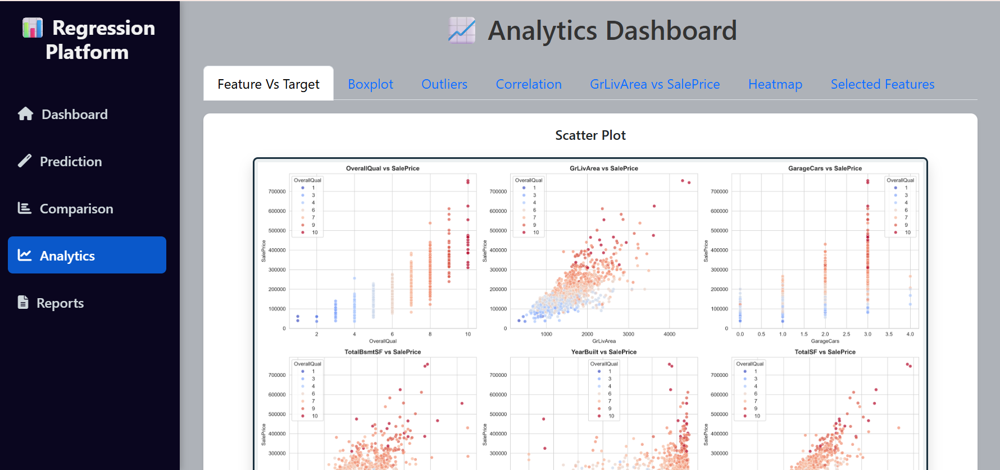
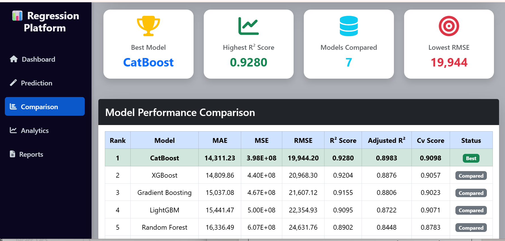
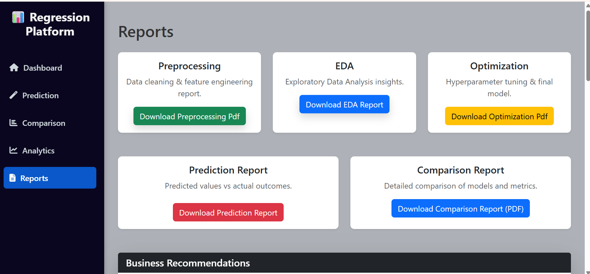

# House Price Prediction & Analytics Platform

A complete Machine Learning web application that predicts house prices using multiple regression algorithms, compares model performance, and provides interactive analytics through a Flask-based dashboard.

---

# Project Overview

This project predicts residential house prices using machine learning techniques. Various regression algorithms are trained and evaluated, with the best-performing model deployed through a professional Flask web application.

The application includes:

- House Price Prediction
- Model Comparison Dashboard
- Analytics Dashboard
- Performance Reports
- SHAP Explainability
- Interactive Visualizations

---

#  Features

## House Price Prediction

- Predict house prices using trained CatBoost Regressor
- Uses engineered features
- Professional prediction summary
- SHAP feature importance explanation

---

## Model Comparison

Compare multiple regression algorithms including:

- Linear Regression
- Decision Tree
- Random Forest
- Gradient Boosting
- XGBoost
- LightGBM
- CatBoost

Performance metrics include:

- MAE
- MSE
- RMSE
- R² Score
- Adjusted R²
- Cross Validation Score

---

## Analytics Dashboard

Includes dataset visualizations such as:

- Sale Price Distribution
- Correlation Heatmap
- Missing Value Heatmap
- Box Plot
- Model Comparison Chart
- Feature Importance

---

##  Reports

Displays

- Best Model Summary
- Model Performance Table
- Prediction Analysis
- Evaluation Metrics

---

# Machine Learning Workflow

Dataset

↓

Data Cleaning

↓

Feature Engineering

↓

Train-Test Split

↓

Model Training

↓

Model Evaluation

↓

Model Comparison

↓

Best Model Selection

↓

Model Saving

↓

Flask Deployment

---

#Screenshots

# Dashboard



# Prediction Page



# Analytics Dashboard



# Comparison



# Report




#  Technologies Used

## Programming Language

- Python

## Machine Learning

- Scikit-Learn
- CatBoost
- XGBoost
- LightGBM

## Data Analysis

- Pandas
- NumPy

## Visualization

- Matplotlib
- Seaborn
- SHAP

## Web Framework

- Flask

## Frontend

- HTML
- CSS
- Bootstrap 5
- Jinja2

---

# Project Structure

```
ML_PROJECT/
│
├── app.py                         # Flask application entry point
├── README.md                      # Project documentation
├── report_generator.py            # PDF report generation functions
├── charts.py                      # Chart generation utilities
├── jupyter.ipynb                  # Model development notebook
│
├── dataset/
│   ├── train.csv
│   ├── test.csv
│   ├── house_data.csv
│   ├── model_comparison.csv
│   └── feature_importance.csv
│
├── models/
│   ├── catboost_model.pkl
│   ├── catboost_model_2.pkl
│   └── feature_columns.pkl
│
├── reports/
│   ├── Data_Preprocessing_Report.pdf
│   ├── Eda_Report.pdf
│   ├── Missing_Value_Report.csv
│   ├── model_comparison_report.pdf
│   ├── optimization_report.pdf
│   └── prediction_report.pdf
│
├── static/
│   ├── css/
│   │   └── style.css
│   └── images/
│       ├── saleprice_histogram.png
│       ├── saleprice_boxplot.png
│       ├── relationship(eda).png
│       ├── feature_vs_target(eda).png
│       ├── model_comparison.png
│       ├── selected_features.png
│       ├── skewness.png
│       ├── missing_value_heatmap.png
│       └── ...
│
├── templates/
│   ├── base.html
│   ├── dashboard.html
│   ├── analytics.html
│   ├── prediction.html
│   ├── comparison.html
│   └── reports.html
│
├── screenshots/
│   ├── dashboard.png
│   ├── analytics.png
│   ├── prediction.png
│   ├── comparison.png
│   └── reports.png
│
└── images/
    └── (Project documentation images)
```
---

# Models Used

| Model | Purpose |
|--------|---------|
| Linear Regression | Baseline Model |
| Decision Tree | Tree-based Regression |
| Random Forest | Ensemble Learning |
| Gradient Boosting | Boosting Technique |
| XGBoost | Optimized Gradient Boosting |
| LightGBM | Fast Gradient Boosting |
| CatBoost | Final Selected Model |

---

# Evaluation Metrics

The following metrics were used to compare model performance:

- Mean Absolute Error (MAE)
- Mean Squared Error (MSE)
- Root Mean Squared Error (RMSE)
- R² Score
- Adjusted R² Score
- Cross Validation Score

---

# Best Model

**CatBoost Regressor**

Performance:

- Highest R² Score
- Lowest MAE
- Lowest RMSE
- Strong Cross Validation Score
- Excellent Generalization Performance

---

# Feature Engineering

Created additional features including:

- HouseAge
- TotalBathrooms
- TotalSF

These engineered features improved model performance.


---

#  Application Modules

## Dashboard

Displays

- Dataset Overview
- Charts
- Project Statistics

---

## Prediction

Allows users to

- Enter house features
- Predict house price
- View SHAP explanation
- View prediction summary

---

## Comparison

Displays

- Model Comparison Table
- Performance Metrics
- Best Model Analysis

---

## Analytics

Provides

- Interactive Visualizations
- Feature Analysis
- Dataset Statistics

---

## Reports

Displays

- Final Model Summary
- Evaluation Results
- Project Performance

---

#  Future Improvements

- User Authentication
- Cloud Deployment
- Live Prediction API
- Database Integration
- Automated Report Generation
- Real-time Model Monitoring

---

#  Learning Outcomes

This project demonstrates:

- Data Preprocessing
- Feature Engineering
- Regression Algorithms
- Model Evaluation
- Model Comparison
- Explainable AI (SHAP)
- Flask Deployment
- Dashboard Development

---

