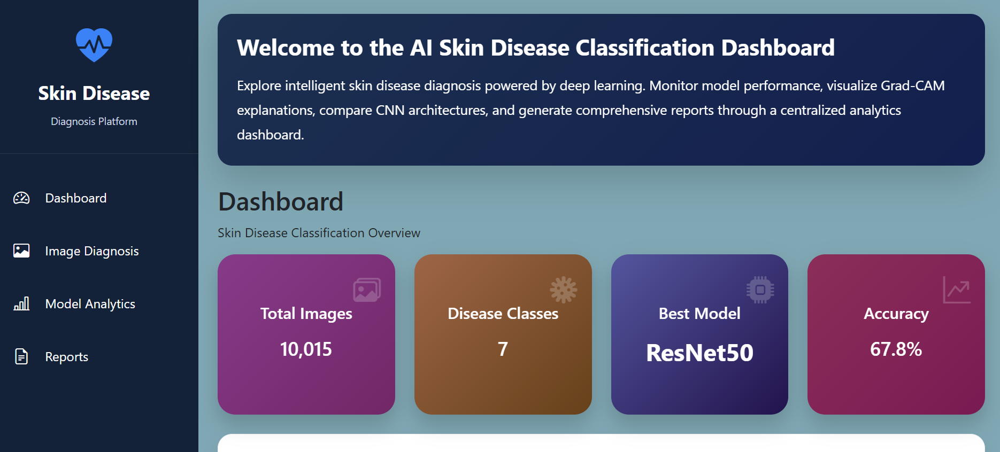
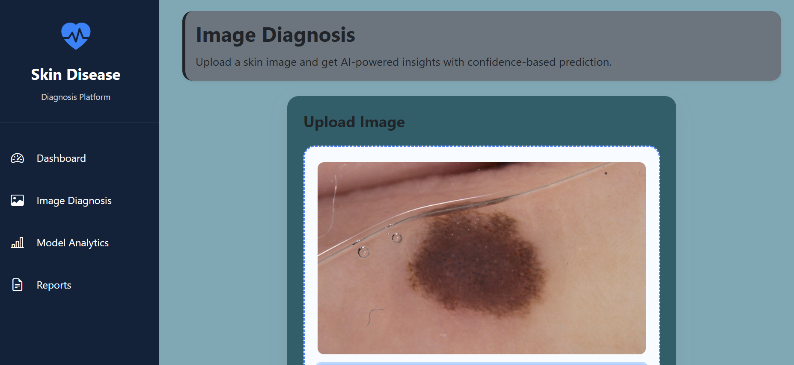
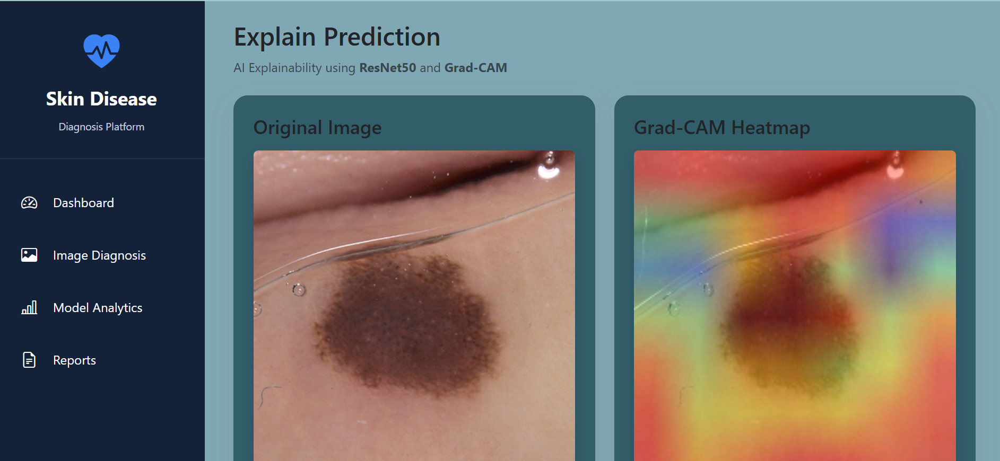
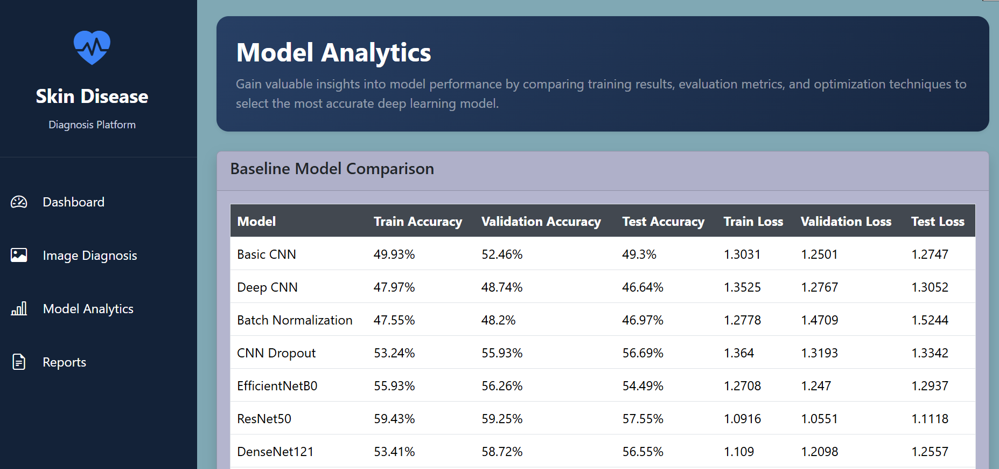

#  AI-Based Multi-Class Skin Disease Classification Using Deep Learning

An AI-powered web application for automatic skin disease classification using Deep Learning and Explainable Artificial Intelligence (XAI). The system classifies dermoscopic skin lesion images into seven skin disease categories, provides Grad-CAM visual explanations, compares multiple deep learning models, and generates downloadable PDF reports.

---

# Project Overview

Skin diseases are among the most common medical conditions worldwide. Early and accurate diagnosis is essential for effective treatment. This project leverages Deep Learning and Transfer Learning techniques to classify dermoscopic skin lesion images into seven disease categories.

Multiple CNN and transfer learning models were developed, trained, optimized, and evaluated using the HAM10000 dataset. After extensive experimentation, **ResNet50 with the SGD optimizer** achieved the best overall performance and was selected for deployment.

The final system includes an interactive Flask web application with Explainable AI (Grad-CAM), model analytics, and PDF report generation.

---

#  Features

- AI-based Skin Disease Classification
- Upload Dermoscopic Images
- Seven-Class Disease Prediction
- Confidence Score & Probability Distribution
- Grad-CAM Explainable AI Visualization
- Model Analytics Dashboard
- Baseline & Optimized Model Comparison
- Prediction Report (PDF)
- Model Comparison Report (PDF)
- Responsive Bootstrap 5 Interface

---

#  Disease Classes

The model predicts the following seven skin diseases:

| Disease | Abbreviation |
|----------|--------------|
| Actinic Keratosis | AKIEC |
| Basal Cell Carcinoma | BCC |
| Benign Keratosis | BKL |
| Dermatofibroma | DF |
| Melanoma | MEL |
| Melanocytic Nevus | NV |
| Vascular Lesion | VASC |

---

#  Dataset

**Dataset Name**

HAM10000 (Human Against Machine with 10000 Training Images)

Dataset Link

https://www.kaggle.com/datasets/kmader/skin-cancer-mnist-ham10000

Dataset Split

- Training : 70%
- Validation : 15%
- Testing : 15%

Image Size

```
224 × 224
```

---

#  Data Preprocessing

The following preprocessing techniques were applied:

- Missing value handling
- Image resizing (224×224)
- Pixel normalization
- Data augmentation
- Label encoding
- Train/Validation/Test splitting
- Class weight balancing

---

# Deep Learning Models

The following models were trained and compared.

- Basic CNN
- Deep CNN
- CNN + Batch Normalization
- CNN + Dropout
- MobileNetV2
- EfficientNetB0
- DenseNet121
- ResNet50

---

# Optimization Techniques

To improve model performance, the following techniques were applied.

- Data Augmentation
- Batch Normalization
- Dropout
- Early Stopping
- Learning Rate Scheduling
- Fine-Tuning
- Optimizer Comparison

Optimizers Evaluated

- SGD
- Adam
- RMSprop

---

# Final Model

**Model Name**

ResNet50

**Optimizer**

SGD

**Reason**

- Highest Test Accuracy
- Better Generalization
- Stable Training
- Effective Grad-CAM Visualization
- Best Overall Performance

---

# Evaluation Metrics

Models were evaluated using

- Accuracy
- Precision
- Recall
- F1 Score
- ROC-AUC
- Confusion Matrix

---

# Explainable AI (Grad-CAM)

Grad-CAM (Gradient-weighted Class Activation Mapping) was integrated into the system to improve model interpretability.

It highlights the image regions that contribute most to the prediction, allowing users to understand the model's decision-making process.

---

# Flask Web Application

The deployed web application consists of the following modules.

## Dashboard

Provides project overview, workflow, model information, and navigation.

---

## Image Diagnosis

Users upload a skin lesion image to receive

- Predicted Disease
- Confidence Score
- Probability Distribution

---

## Explain Prediction

Displays

- Original Image
- Grad-CAM Heatmap
- Prediction Summary
- AI Explanation

---

## Model Analytics

Displays

- Baseline Model Comparison
- Optimized Model Comparison
- Evaluation Metrics
- Accuracy Charts
- Loss Charts
- Confusion Matrix

---

## Reports

Allows users to download

- Prediction Report (PDF)
- Model Comparison Report (PDF)

---

# 🛠 Technologies Used

## Programming Language

- Python

## Deep Learning

- TensorFlow
- Keras

## Computer Vision

- OpenCV

## Web Framework

- Flask

## Frontend

- HTML5
- CSS3
- Bootstrap 5
- JavaScript

## Visualization

- Chart.js
- Matplotlib

## Report Generation

- ReportLab

---

#  Project Structure

```
AI-Skin-Disease-Classification/
│
├── app.py
├── report_generator.py
├── requirements.txt
├── README.md
│
├── models/
│     └── resnet_SGD.keras
│
├── comparison/
│     ├── model_comparison.csv
│     ├── optimization_summary.csv
│     └── evaluation_comparison.csv
│
├── static/
│     ├── css/
│     ├── js/
│     ├── images/
│     └── uploads/
│
├── templates/
│     ├── dashboard.html
│     ├── image_diagnosis.html
│     ├── explain_prediction.html
│     ├── model_analytics.html
│     └── reports.html
│
└── screenshots/
      ├── dashboard.png
      ├── image_diagnosis.png
      ├── explain_prediction.png
      ├── model_analytics.png
      ├── reports.png
      ├── prediction_report.png
      └── model_comparison_report.png
```

---

# Installation

## Clone Repository

```bash
git clone https://github.com/yourusername/AI-Skin-Disease-Classification.git
```

---

## Change Directory

```bash
cd AI-Skin-Disease-Classification
```

---

## Create Virtual Environment

Windows

```bash
python -m venv tfenv
```

Activate Environment

Windows

```bash
tfenv\Scripts\activate
```

Mac/Linux

```bash
source tfenv/bin/activate
```

---

## Install Dependencies

```bash
pip install -r requirements.txt
```

---

## Run Flask Application

```bash
python app.py
```

---

Open Browser

```
http://127.0.0.1:5000
```

---

# Application Screenshots

## Dashboard

<p align="center">

</p>

---

##  Image Diagnosis

<p align="center">

</p>

---

## Explain Prediction (Grad-CAM)

<p align="center">

</p>

---

## Model Analytics

<p align="center">

</p>

---

# Application Workflow

```
Skin Image Upload
        │
        ▼
Image Preprocessing
        │
        ▼
ResNet50 (SGD)
        │
        ▼
Disease Prediction
        │
        ▼
Grad-CAM Visualization
        │
        ▼
Prediction Report
        │
        ▼
Model Analytics
        │
        ▼
Model Comparison Report
```

---

# Future Enhancements

- Mobile Application
- Real-time Camera Diagnosis
- Cloud Deployment
- Multi-language Support
- Doctor Recommendation System
- Electronic Medical Record Integration

