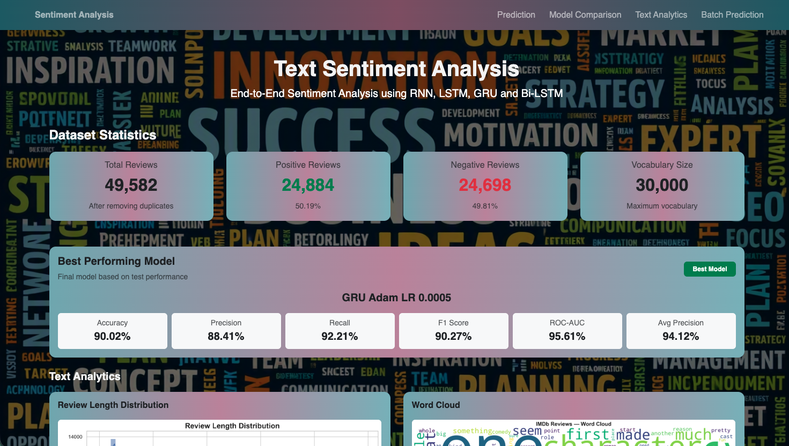
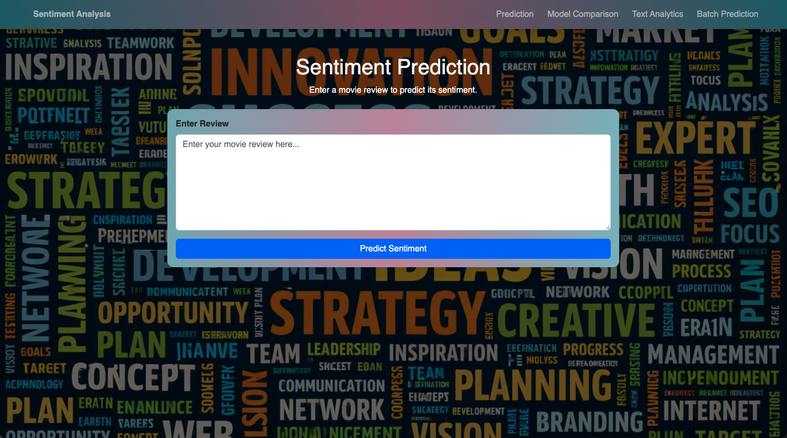
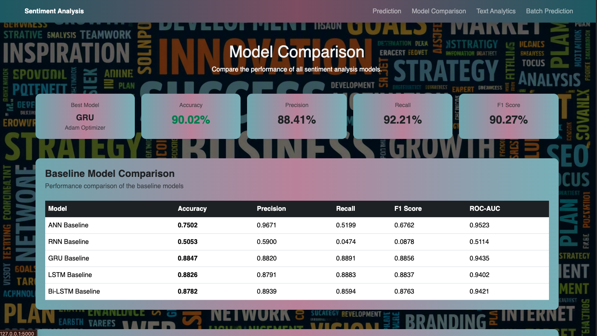
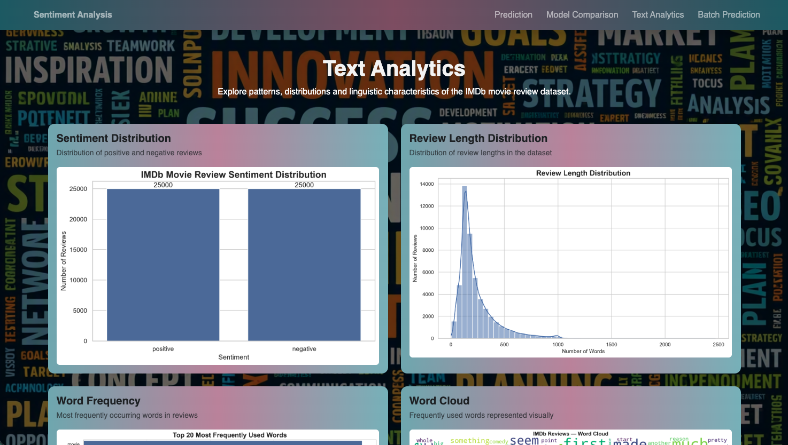
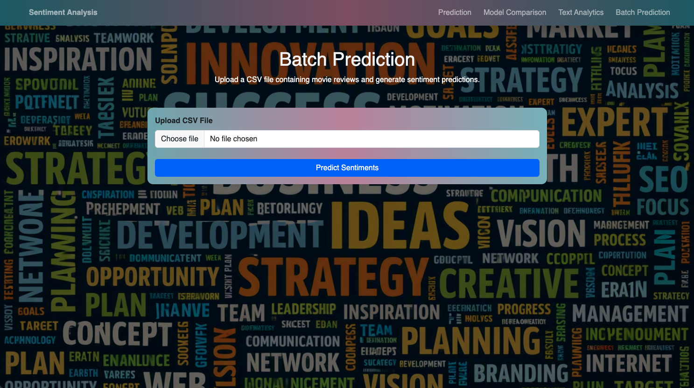

# End-to-End Text Sentiment Analysis

## Project Overview

This project implements an end-to-end **Text Sentiment Analysis System** using the IMDb Movie Reviews dataset.

The system analyzes movie reviews and classifies them into two sentiment categories:

* **Positive**
* **Negative**

Multiple machine learning and deep learning approaches were implemented and compared, including:

* TF-IDF + Logistic Regression
* ANN
* RNN
* LSTM
* GRU
* Bidirectional LSTM

After comparing different architectures and hyperparameters, the **GRU model with Adam optimizer and learning rate 0.0005** was selected as the final deep learning model.

The trained model was integrated into a **Flask web application** that supports single-review prediction, batch prediction, model comparison, and dataset analytics.

---

## Objectives

The main objectives of this project are:

1. Analyze the IMDb movie review dataset.
2. Perform text preprocessing and exploratory data analysis.
3. Convert text into numerical representations.
4. Implement TF-IDF as a traditional machine learning baseline.
5. Build ANN, RNN, LSTM, GRU and Bi-LSTM models.
6. Compare model performance using multiple evaluation metrics.
7. Perform hyperparameter and optimizer experiments.
8. Select the best-performing model.
9. Save the trained model and preprocessing configuration.
10. Deploy the sentiment analysis model using Flask.
11. Provide single and batch review prediction through a web interface.

---

# 📂 Project Structure

```text
week_11/
│
├── app.py
├── requirements.txt
├── README.md
│
├── dataset/
│   └── IMDB Dataset.csv
│
├── notebooks/
│   ├── phase1/
│   ├── phase2/
│   ├── phase3/
│   ├── phase4/
│   ├── phase5/
│   ├── phase6/
│   └── phase7_results/
│
├── processed_data/
│   └── imdb_cleaned.csv
│
├── models/
│   ├── phase4_baseline_comparison.csv
│   ├── phase7_final_model_comparison.csv
│   └── ...
│
├── static/
│   ├── css/
│   │   └── style.css
│   │
│   │
│   └── images/
│       ├── wordcloud.png
│       ├── review_length_distribution.png
│       ├── tfidf_confusion_matrix.png
│       └── phase4_ann_confusion_matrix.png
│
├── templates/
│   ├── base.html
│   ├── dashboard.html
│   ├── prediction.html
│   ├── batch_prediction.html
│   ├── comparison.html
│   └── analytics.html
│
└── venv/
```

---

#  Dataset

The project uses the **IMDb Movie Reviews Dataset**, containing movie reviews labeled as either positive or negative.

### Original dataset

```text
Total reviews: 50,000
Columns: 2
```

Columns:

```text
review
sentiment
```

After removing duplicate reviews:

```text
Total reviews: 49,582
```

### Sentiment distribution

```text
Positive: 24,884
Negative: 24,698
```

The dataset is approximately balanced between the two sentiment classes.

---

# Phase 1 — Dataset Understanding & Exploratory Data Analysis

The first phase focuses on understanding the dataset.

### Tasks performed

* Dataset loading
* Dataset shape analysis
* Missing-value checking
* Duplicate detection
* Sentiment distribution
* Review length analysis
* Word frequency analysis
* Stopword analysis
* Word cloud generation
* Character and word count analysis


# Phase 2 — Text Preprocessing & Tokenization

Phase 2 prepares raw text for machine learning and deep learning models.

## Text Cleaning

The preprocessing pipeline includes:

1. Convert text to lowercase.
2. Remove HTML tags.
3. Remove non-alphabetic characters.
4. Remove extra spaces.
5. Tokenize text.
6. Convert tokens into integer IDs.
7. Pad sequences to a fixed length.


#  Phase 3 — Feature Representation

Different text representation approaches were investigated.

## 1. Integer Encoding
## 2. TF-IDF
## 3. Word Embedding

#  Phase 4 — Baseline Model Comparison

The baseline models were trained and evaluated using the same sentiment classification task.

Models:

* ANN Baseline
* RNN Baseline
* GRU Baseline
* LSTM Baseline
* Bi-LSTM Baseline

## Baseline Results

| Model            | Accuracy | Precision | Recall | F1 Score | ROC-AUC |
| ---------------- | -------: | --------: | -----: | -------: | ------: |
| ANN Baseline     |   75.02% |    96.71% | 51.99% |   67.62% |  95.23% |
| RNN Baseline     |   50.53% |    59.00% |  4.74% |    8.78% |  51.14% |
| GRU Baseline     |   88.47% |    88.20% | 88.91% |   88.56% |  94.35% |
| LSTM Baseline    |   88.26% |    87.91% | 88.83% |   88.37% |  94.02% |
| Bi-LSTM Baseline |   87.82% |    89.39% | 85.94% |   87.63% |  94.21% |

### Baseline conclusion

Among the baseline deep learning models, the **GRU model achieved the strongest overall balance of accuracy, precision, recall and F1 score**.

---

# Phase 5 — Deep Learning Model Development

Deep learning architectures were developed using TensorFlow/Keras.
## GRU Architecture

The main GRU architecture is:

```text
Input
  ↓
Embedding
  ↓
GRU(128)
  ↓
Dense(64, ReLU)
  ↓
Dense(1, Sigmoid)
  ↓
Sentiment
```

### Model configuration

```text
Vocabulary Size = 30,000
Embedding Dimension = 128
GRU Units = 128
Dense Units = 64
Output = 1
Activation = Sigmoid
```

The sigmoid output produces a probability between 0 and 1.

```text
< 0.5 → Negative
≥ 0.5 → Positive
```

---

# 🔹 Phase 6 — Training & Optimization

Different training configurations were investigated.

### Important hyperparameters

* Optimizer
* Learning rate
* Batch size
* Number of epochs
* Dropout
* Early stopping
* Sequence length
* GRU/LSTM units

### Optimizers explored

* Adam
* RMSprop
* SGD

The final GRU configuration uses:

```text
Optimizer: Adam
Learning Rate: 0.0005
```

# 🔹 Phase 7 — Final Evaluation & Model Selection

The final models were evaluated using:

* Accuracy
* Precision
* Recall
* F1 Score
* ROC-AUC
* Average Precision
* Confusion Matrix

---

#  Final Selected Model

The final selected model is:

```text
GRU
Optimizer: Adam
Learning Rate: 0.0005
```

### Final Test Performance

| Metric            |  Score |
| ----------------- | -----: |
| Accuracy          | 90.02% |
| Precision         | 88.41% |
| Recall            | 92.21% |
| F1 Score          | 90.27% |
| ROC-AUC           | 95.61% |
| Average Precision | 94.12% |

The GRU model was selected because it provided a strong overall balance between classification performance and model complexity.

---

# Evaluation Metrics

## Accuracy

Measures the percentage of correctly classified reviews.

```text
Correct Predictions
──────────────────── × 100
Total Predictions
```

---

## Precision

Measures how many predicted positive reviews were actually positive.

```text
TP
──────
TP + FP
```

---

## Recall

Measures how many actual positive reviews were correctly identified.

```text
TP
──────
TP + FN
```

---

## F1 Score

F1 score provides a balance between precision and recall.

```text
F1 = 2 × Precision × Recall
     ───────────────────────
       Precision + Recall
```

---

## ROC-AUC

ROC-AUC measures the model's ability to distinguish between positive and negative classes across different classification thresholds.

---

# 📌 Confusion Matrix

The confusion matrix contains four values:

```text
                    Predicted
                 Negative  Positive

Actual Negative     TN        FP

Actual Positive     FN        TP
```

Where:

* **TP** = True Positive
* **TN** = True Negative
* **FP** = False Positive
* **FN** = False Negative

---

# Flask Web Application

The trained sentiment model was integrated into a Flask web application.

The application provides:

### Dashboard

Displays:

* Dataset statistics
* Best model information
* Model performance
* Text analytics
* Review statistics
* Visualizations


# Flask Prediction Pipeline

The deployed prediction pipeline is:

```text
User Review
     ↓
Text Cleaning
     ↓
Tokenizer
     ↓
Integer Encoding
     ↓
Padding to 500
     ↓
Loaded GRU Model
     ↓
Prediction Probability
     ↓
Sentiment Classification
     ↓
Web Result
```

The same preprocessing configuration used during training is used during prediction to maintain consistency.

## Project Screenshots












# Technologies Used

### Programming Language

* Python

### Data Processing

* NumPy
* Pandas

### NLP

* NLTK
* Scikit-learn
* TF-IDF
* Keras Tokenizer

### Deep Learning

* TensorFlow
* Keras

### Visualization

* Matplotlib
* Seaborn
* WordCloud

### Web Development

* Flask
* HTML
* CSS
* Bootstrap
* Jinja2

### Development Tools

* Jupyter Notebook
* VS Code
* Git
* GitHub

---

# Installation

## 1. Clone the Repository

```bash
git clone <your-repository-url>
cd week_11
```

---

## 2. Create Virtual Environment

### Windows

```powershell
python -m venv venv
```

Activate:

```powershell
.\venv\Scripts\Activate.ps1
```

If PowerShell blocks script execution:

```powershell
Set-ExecutionPolicy -Scope Process -ExecutionPolicy RemoteSigned
```

Then:

```powershell
.\venv\Scripts\Activate.ps1
```

---

## 3. Install Dependencies

```bash
pip install -r requirements.txt
```

---

#  Run the Flask Application

Make sure the virtual environment is activated.

```bash
python app.py
```

The Flask application will start locally.

Open the local address shown in the terminal in your browser.

---

# Requirements

Main dependencies include:

```text
tensorflow
numpy
pandas
scikit-learn
nltk
matplotlib
seaborn
flask
wordcloud
```

The exact package versions are maintained in:

```text
requirements.txt
```

---

# Important Deployment Consideration

The tokenizer and preprocessing configuration must match the configuration used during model training.


# Project Results

The project demonstrates that sequence-based deep learning models can effectively classify IMDb movie reviews.

The baseline comparison showed that:

* Basic RNN performed poorly on this task.
* ANN provided moderate performance.
* LSTM performed strongly.
* Bi-LSTM performed strongly.
* GRU provided the best baseline performance among the tested deep learning architectures.

After additional experiments and optimization, the final GRU model achieved approximately:

```text
Accuracy       : 90.02%
Precision      : 88.41%
Recall         : 92.21%
F1 Score       : 90.27%
ROC-AUC        : 95.61%
Average Precision: 94.12%
```

---

# Future Improvements

Possible future improvements include:

* Transformer-based sentiment models
* BERT-based classification
* Hyperparameter optimization
* Pre-trained word embeddings
* Larger sentiment datasets
* Explainable AI for sentiment predictions
* REST API deployment
* Docker containerization
* Cloud deployment
* Real-time sentiment analytics

---

#  Project Summary

This project demonstrates a complete machine learning lifecycle:

```text
Dataset
   ↓
Exploratory Data Analysis
   ↓
Text Preprocessing
   ↓
Tokenization
   ↓
Feature Representation
   ↓
TF-IDF Baseline
   ↓
Deep Learning Models
   ↓
Model Training
   ↓
Hyperparameter Experiments
   ↓
Model Evaluation
   ↓
Final GRU Selection
   ↓
Model Saving
   ↓
Flask Integration
   ↓
Single & Batch Prediction
   ↓
Web Dashboard
```

The final system provides an end-to-end solution for **IMDb movie review sentiment classification** using deep learning and Flask.
